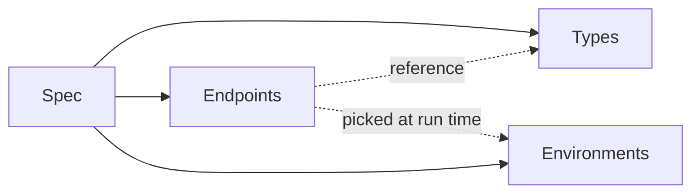

# Core Concepts

Zwaggen has a small vocabulary. Once you've got these four words, every feature page makes sense.

## The four pieces

- **Spec** — a single `.zwag` file. The source of truth. Versioned in git.
- **Types** — reusable shapes: strings, numbers, objects, arrays, unions, refs to other types.
- **Endpoints** — HTTP operations (`GET /todos`, `POST /orders`, …). Each references types for its params, request body, and responses.
- **Environments** — named value sets: `dev`, `staging`, `prod`. Each holds a base URL, auth preset, and any variables referenced in a request (e.g. `{{env.apiKey}}`).

## Spec

The spec is the root object. It holds every Type, Endpoint, and Environment. The JSON shape is documented in `docs/rules/spec-versioning.md` in the repo; the current on-disk `schemaVersion` is `4`.

You never hand-edit this file in practice — the UI owns it. But because it's JSON, it diffs cleanly in git, which is what makes [Spec Diff](/guide/spec-diff) and pull-request review useful.

## Types

Types live in a namespace keyed by name. You can:

- define a scalar (`string`, `number`, `integer`, `boolean`, `null`, `literal`),
- define a composite (`array`, `object`, `union`),
- or reference another type by name (`ref`).

Object types can **extend** one or more parent object types to inherit fields and override selectively — see [Type Inheritance](/guide/type-inheritance). Types and endpoints can also be organized into nested [Folders](/guide/folders) for large specs.

Types are the glue. A change to `Todo` instantly changes every endpoint that returns it. See [Type Builder](/guide/type-builder).

## Endpoints

An endpoint is a method + path plus:

- path / query / header params (each a `ParamDef` with a type),
- an optional request body (any type),
- one or more response shapes keyed by status,
- an auth preset (none, bearer, basic, or API key),
- optional tags (grouping in the sidebar) or a [folder](/guide/folders) path,
- optional assertions (see [Assertions & Chaining](/guide/assertions-and-chaining)).

See [Endpoints](/guide/endpoints).

## Environments

An environment holds the per-deployment bits:

- **Base URL** (overrides the spec-level base URL).
- **Auth preset** (bearer token, basic creds, API key header/query).
- **Variables** — key/value pairs you reference as `{{env.name}}` in paths, headers, or bodies.

Switch environments from the top bar. The Run panel always uses the active environment.

## How a run works

When you hit **Send** in the Run panel, Zwaggen:

1. Resolves `{{env.*}}` placeholders (including any values written by a previous capture) in the path, headers, and body.
2. Applies the environment's auth preset.
3. Sends the request (via the browser, or via the [bundled CORS proxy](/guide/cors-proxy) when **Use proxy** is on).
4. Validates the response body against the response type for the status code it got back.
5. Records the run in [History](/guide/batch-and-history).
6. Evaluates any [assertions](/guide/assertions-and-chaining) and marks the run pass/fail.
