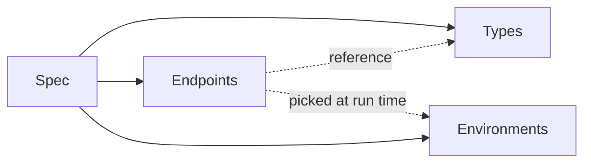

# 核心概念

Zwaggen 的詞彙不多。只要掌握下面這四個字，之後每一頁功能說明都能看得懂。

## 四個組成

- **Spec**（規格）— 一份 `.zwaggen.json` 檔案。單一真相來源，放進 git 做版本控制。
- **Types**（型別）— 可重複使用的結構：string、number、object、array、union，或 ref 到其他型別。
- **Endpoints**（端點）— HTTP 操作（`GET /todos`、`POST /orders` …）。每個端點會為自己的參數、請求內容、回應各自 ref 一個型別。
- **Environments**（環境）— 一組具名的值：`dev`、`staging`、`prod`。每個環境帶自己的 base URL、認證預設，以及請求中會用到的變數（例如 `{{env.apiKey}}`）。

## 規格（Spec）

規格是根物件，裡面裝著所有的型別、端點、環境。JSON 結構記錄在 repo 的 `docs/rules/spec-versioning.md`；目前磁碟上的 `schemaVersion` 是 `4`。

實務上你不會去手動編輯這個檔案 — UI 會幫你管。但因為它就是 JSON，在 git 裡 diff 得很乾淨，這也是讓 [規格差異](/zh-TW/guide/spec-diff) 與 pull request 審查真正有用的關鍵。

## 型別（Types）

型別放在一個以名稱為 key 的命名空間裡。你可以：

- 定義 scalar（`string`、`number`、`integer`、`boolean`、`null`、`literal`）；
- 定義 composite（`array`、`object`、`union`）；
- 或用名稱 ref 到另一個型別（`ref`）。

物件型別可以**繼承**一個或多個父物件型別，繼承欄位並選擇性覆寫——請見[型別繼承](/zh-TW/guide/type-inheritance)。型別與端點也可以組織到巢狀的[資料夾](/zh-TW/guide/folders)裡，適合大型規格。

型別是把一切黏起來的東西。改一次 `Todo`，每一個回傳它的端點都會跟著變。請見[型別建構器](/zh-TW/guide/type-builder)。

## 端點（Endpoints）

一個端點由 method + path 組成，再加上：

- 路徑 / 查詢 / 標頭參數（每個都是帶型別的 `ParamDef`）；
- 選填的請求內容（任何型別都行）；
- 一個或多個以狀態碼為 key 的回應結構；
- 認證預設（none、bearer、basic 或 API key）；
- 選填的 tag（用於側欄分群）或[資料夾](/zh-TW/guide/folders)路徑；
- 選填的斷言（見[斷言與串接](/zh-TW/guide/assertions-and-chaining)）。

請見[端點](/zh-TW/guide/endpoints)。

## 環境（Environments）

環境裝著每個部署專屬的部分：

- **Base URL**（覆寫規格層級的 base URL）。
- **認證預設**（bearer token、basic 憑證、API key 標頭或查詢參數）。
- **變數** — key/value 對，在路徑、標頭或內容中用 `{{env.name}}` 引用。

從頂列切換環境。執行面板永遠用當前啟用中的環境。

## 一次執行背後發生了什麼

當你在執行面板按下 **送出**（Send），Zwaggen 會：

1. 解析路徑、標頭、內容裡的 `{{env.*}}` 佔位符（包括先前擷取寫入的值）。
2. 套用當前環境的認證預設。
3. 送出請求（由瀏覽器直接送，或透過設定好的 `zwaggen-proxy` 轉送）。
4. 用實際回應狀態碼對應到的回應型別，驗證回應內容。
5. 把這次執行寫進[歷史紀錄](/zh-TW/guide/batch-and-history)。
6. 跑完所有[斷言](/zh-TW/guide/assertions-and-chaining)，標記這次執行是通過還是失敗。
