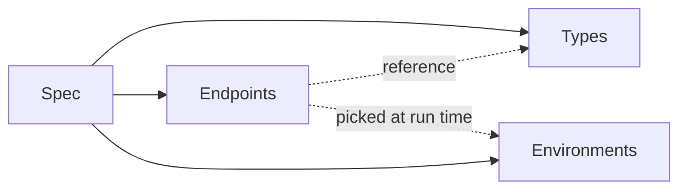

# 核心概念

Zwaggen 的詞彙不多。只要掌握以下這四個字，每一頁功能說明都能看懂。

## 四個組成

- **Spec**（規格）— 單一的 `.zwaggen.json` 檔案。是唯一的事實來源，在 git 中做版本控制。
- **Types**（型別）— 可重複使用的結構：strings、numbers、objects、arrays、unions、refs 到其他型別。
- **Endpoints**（端點）— HTTP 操作（`GET /todos`、`POST /orders`⋯）。每個端點都會為其參數、請求內容、回應參照型別。
- **Environments**（環境）— 有命名的一組值：`dev`、`staging`、`prod`。每個環境帶有一個根網址、認證預設，以及請求中會引用到的任何變數（例如 `{{env.apiKey}}`）。

## 規格（Spec）

規格是根物件。它裝著每一個型別、端點、環境。JSON 結構記錄在 repo 的 `docs/rules/spec-versioning.md`；目前磁碟上的 `schemaVersion` 是 `1`。

實務上你不會手動編輯這個檔案 — UI 負責管理它。但因為它是 JSON，在 git 中可以乾淨地做 diff，這也是讓 [規格差異](/guide/spec-diff) 與 pull request 審查變得實用的關鍵。

## 型別（Types）

型別存放在一個以名稱為 key 的扁平命名空間中。你可以：

- 定義 scalar（`string`、`number`、`integer`、`boolean`、`null`、`literal`）；
- 定義 composite（`array`、`object`、`union`）；
- 或以名稱參照另一個型別（`ref`）。

型別是黏著劑。對 `Todo` 的一次修改會即時影響每一個回傳它的端點。請見[型別建構器](/guide/type-builder)。

## 端點（Endpoints）

一個端點包含 method + path，再加上：

- 路徑 / 查詢 / 標頭參數（每個都是一個帶型別的 `ParamDef`）；
- 選填的請求內容（任意型別）；
- 一個或多個以狀態為 key 的回應結構；
- 認證預設（無、bearer、basic 或 API key）；
- 選填的 tag（用於側欄分群）；
- 選填的斷言（見[斷言與串接](/guide/assertions-and-chaining)）。

請見[端點](/guide/endpoints)。

## 環境（Environments）

環境裝著每個部署專屬的部分：

- **Base URL**（覆蓋規格層級的根網址）。
- **認證預設**（bearer token、basic 憑證、API key 標頭 / 查詢參數）。
- **變數** — key/value 對，在路徑、標頭或內容中以 `{{env.name}}` 引用。

從頂列切換環境。執行面板永遠使用目前啟用的環境。

## 一次執行發生了什麼

當你在執行面板按下 **送出**（Send），Zwaggen 會：

1. 解析路徑、標頭、內容中的 `{{env.*}}` 與 `{{chain.*}}` 佔位符。
2. 套用該環境的認證預設。
3. 送出請求（由瀏覽器直接送，或透過有設定的 `zwaggen-proxy`）。
4. 以回應實際得到的狀態碼所對應的回應型別，驗證回應內容。
5. 把這次執行記錄到[歷史紀錄](/guide/batch-and-history)。
6. 評估任何[斷言](/guide/assertions-and-chaining)並標記這次執行是通過或失敗。
