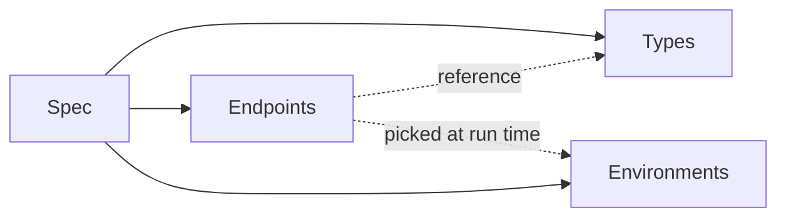

# Tutorial Docs Site — Implementation Plan

> **For agentic workers:** REQUIRED SUB-SKILL: Use `superpowers:subagent-driven-development` (project default per `CLAUDE.md`). Each Task below = one small commit inside a `.worktrees/tutorial-docs-site` worktree on branch `plan/tutorial-docs-site`. The master tracks TodoWrite; each subagent gets a single Task. Never `cd` into the primary repo for git ops.

**Goal:** Stand up a VitePress-based user-manual at `apps/docs/` with 13 guide pages covering every shipped Zwaggen feature; English canonical, zh-TW translated incrementally; local dev/build only on day one.

**Architecture:** New pnpm workspace `apps/docs/` (auto-registered by the existing `apps/*` glob in `pnpm-workspace.yaml`). VitePress 1.x default theme, en + zh-TW locales, Mermaid via `vitepress-plugin-mermaid`. Root `package.json` gains `docs:dev|build|preview` scripts. Sidebar lists only pages that physically exist (no zh-TW stubs).

**Tech Stack:** VitePress 1.x, Mermaid 10, pnpm 10, Node ≥ 20, TypeScript 5.5. No new runtime deps in `apps/web` or `packages/proxy`.

**Spec:** `docs/specs/active/2026-04-18-tutorial-docs-site.md`.

---

## Conventions for every task

- **Worktree:** all work happens inside `.worktrees/tutorial-docs-site/`. Subagents run git from there.
- **Commit trailer:** every commit ends with `Co-Authored-By: Claude Opus 4.7 (1M context) <noreply@anthropic.com>`.
- **TODO tick:** every task's final commit also ticks its corresponding `Stage …` checkbox in `docs/TODO.md` (change `[ ]` → `[x]`) and includes `docs/TODO.md` in the `git add`. So each stage has a single atomic commit: content change + checkbox tick.
- **Content language:** English canonical. Use plain, short sentences. No marketing prose. Mirror Vue/VitePress docs tone.
- **Markdown links:** relative, starting with `/` for root-locale-relative (e.g. `/guide/type-builder`). VitePress resolves these.
- **Code blocks:** use fenced blocks with language hint (` ```ts `, ` ```bash `, ` ```json `).
- **Build = truth:** `pnpm --filter docs build` must exit 0 with no warnings at the end of every task. Dead-link detection is on (`ignoreDeadLinks: false`), so a typoed link fails the build.
- **Placeholder repo URL:** use `https://github.com/vliang/Zwaggen` throughout. If the actual repo URL differs, a single find-and-replace at deploy time handles it.
- **Screenshots:** none required until Task 18. Content tasks use prose + code blocks only.

---

## Task 1: Stage 0a — Workspace scaffold

**Files:**
- Create: `apps/docs/package.json`
- Create: `apps/docs/tsconfig.json`
- Create: `apps/docs/.gitignore`
- Create: `apps/docs/index.md`
- Modify: `package.json` (root, add scripts)
- Modify: `docs/TODO.md` (add parent checkbox + sub-items for this plan)

- [ ] **Step 1: Add tracking rows to `docs/TODO.md`**

Under the **Feature** heading, append (keep existing items):

```md
- [ ] Tutorial docs site (VitePress) — `apps/docs/`
  - [ ] Stage 0a: workspace scaffold
  - [ ] Stage 0b: site shell + sidebar + locales
  - [ ] Stage 0c: zh-TW homepage
  - [ ] Stage 1: Introduction (en)
  - [ ] Stage 2: Installation (en)
  - [ ] Stage 3: Quickstart (en)
  - [ ] Stage 4: Core Concepts (en) + diagram
  - [ ] Stage 5: Type Builder (en)
  - [ ] Stage 6: Endpoints (en)
  - [ ] Stage 7: Running Requests (en)
  - [ ] Stage 8: Assertions & Chaining (en)
  - [ ] Stage 9: Batch & History (en)
  - [ ] Stage 10: OpenAPI Import (en)
  - [ ] Stage 11: Spec Diff (en)
  - [ ] Stage 12: Export & cURL (en)
  - [ ] Stage 13: CORS Proxy (en)
  - [ ] Stage 14: zh-TW Introduction
  - [ ] Stage 15: Screenshot sweep
```

Also bump the `Last updated:` line at the top of `docs/TODO.md` to today's date (`2026-04-18`).

After every subsequent task's commit, tick the matching sub-checkbox in `docs/TODO.md` as part of that same commit — so TODO state tracks branch state.

- [ ] **Step 2: Create `apps/docs/package.json`**

```json
{
  "name": "docs",
  "private": true,
  "type": "module",
  "scripts": {
    "dev": "vitepress dev",
    "build": "vitepress build",
    "preview": "vitepress preview",
    "lint": "echo \"no-op\""
  },
  "devDependencies": {
    "vitepress": "^1.3.0",
    "vitepress-plugin-mermaid": "^2.0.17",
    "mermaid": "^10.9.0"
  }
}
```

The `lint` no-op exists so `pnpm -r lint` from the root doesn't fail when it hits the docs workspace.

- [ ] **Step 3: Create `apps/docs/tsconfig.json`**

```json
{
  "extends": "../../tsconfig.base.json",
  "compilerOptions": {
    "types": ["node"],
    "noEmit": true
  },
  "include": [".vitepress/**/*.ts", ".vitepress/**/*.mts"]
}
```

- [ ] **Step 4: Create `apps/docs/.gitignore`**

```
.vitepress/cache
.vitepress/dist
node_modules
```

- [ ] **Step 5: Create a placeholder `apps/docs/index.md`** (content replaced in Task 2)

```md
# Zwaggen

VitePress scaffold ready. Site shell lands in the next task.
```

- [ ] **Step 6: Add root scripts to `package.json`**

Replace the root `scripts` block with:

```json
"scripts": {
  "dev": "pnpm --filter web dev",
  "build": "pnpm -r build",
  "test": "pnpm -r test",
  "lint": "pnpm -r lint",
  "docs:dev": "pnpm --filter docs dev",
  "docs:build": "pnpm --filter docs build",
  "docs:preview": "pnpm --filter docs preview"
}
```

Leave `name`, `private`, `packageManager` unchanged.

- [ ] **Step 7: Install dependencies**

Run (from worktree root):

```bash
pnpm install
```

Expected: `apps/docs` appears in pnpm output, VitePress/Mermaid install cleanly.

- [ ] **Step 8: Verify dev boot**

Run:

```bash
pnpm docs:dev
```

Expected: `vitepress v1.x.x` banner, local URL printed, page loads showing the "VitePress scaffold ready" text. Kill the server (Ctrl+C) after confirming.

- [ ] **Step 9: Verify build**

Run:

```bash
pnpm docs:build
```

Expected: exits 0, writes `apps/docs/.vitepress/dist/`.

- [ ] **Step 10: Verify existing workspaces still pass**

Run:

```bash
pnpm --filter web lint
pnpm --filter web test
pnpm --filter zwaggen-proxy test
```

Expected: all three pass. (We changed only root `package.json` scripts and added a new workspace; nothing existing should break.)

- [ ] **Step 11: Tick Stage 0a in `docs/TODO.md` and commit**

In `docs/TODO.md`, change `- [ ] Stage 0a: workspace scaffold` to `- [x] Stage 0a: workspace scaffold`.

Then:

```bash
git add apps/docs package.json pnpm-lock.yaml docs/TODO.md
git commit -m "$(cat <<'EOF'
docs(site): scaffold apps/docs workspace with VitePress

Adds new pnpm workspace with VitePress 1.x + Mermaid. Root gains
docs:dev|build|preview scripts. Placeholder home page; site shell
lands in the next commit.

Co-Authored-By: Claude Opus 4.7 (1M context) <noreply@anthropic.com>
EOF
)"
```

---

## Task 2: Stage 0b — VitePress config + sidebar skeleton

**Files:**
- Create: `apps/docs/.vitepress/config.ts`
- Create: `apps/docs/introduction.md` (stub)
- Create: `apps/docs/installation.md` (stub)
- Create: `apps/docs/quickstart.md` (stub)
- Create: `apps/docs/guide/core-concepts.md` (stub)
- Create: `apps/docs/guide/type-builder.md` (stub)
- Create: `apps/docs/guide/endpoints.md` (stub)
- Create: `apps/docs/guide/running-requests.md` (stub)
- Create: `apps/docs/guide/assertions-and-chaining.md` (stub)
- Create: `apps/docs/guide/batch-and-history.md` (stub)
- Create: `apps/docs/guide/openapi-import.md` (stub)
- Create: `apps/docs/guide/spec-diff.md` (stub)
- Create: `apps/docs/guide/export-and-curl.md` (stub)
- Create: `apps/docs/guide/cors-proxy.md` (stub)
- Modify: `apps/docs/index.md` (replace with hero layout)

- [ ] **Step 1: Create `apps/docs/.vitepress/config.ts`**

```ts
import { defineConfig } from 'vitepress';
import { withMermaid } from 'vitepress-plugin-mermaid';

const GITHUB_URL = 'https://github.com/vliang/Zwaggen';

export default withMermaid(defineConfig({
  title: 'Zwaggen',
  description: 'Typed API spec builder + runtime tester',
  cleanUrls: true,
  ignoreDeadLinks: false,

  locales: {
    root: {
      label: 'English',
      lang: 'en',
      themeConfig: {
        nav: [
          { text: 'Guide', link: '/introduction' },
          { text: 'GitHub', link: GITHUB_URL },
        ],
        sidebar: [
          {
            text: 'Getting Started',
            items: [
              { text: 'Introduction', link: '/introduction' },
              { text: 'Installation', link: '/installation' },
              { text: 'Quickstart', link: '/quickstart' },
            ],
          },
          {
            text: 'Guide',
            items: [
              { text: 'Core Concepts', link: '/guide/core-concepts' },
              { text: 'Type Builder', link: '/guide/type-builder' },
              { text: 'Endpoints', link: '/guide/endpoints' },
              { text: 'Running Requests', link: '/guide/running-requests' },
              { text: 'Assertions & Chaining', link: '/guide/assertions-and-chaining' },
              { text: 'Batch & History', link: '/guide/batch-and-history' },
              { text: 'OpenAPI Import', link: '/guide/openapi-import' },
              { text: 'Spec Diff', link: '/guide/spec-diff' },
              { text: 'Export & cURL', link: '/guide/export-and-curl' },
              { text: 'CORS Proxy', link: '/guide/cors-proxy' },
            ],
          },
        ],
      },
    },
    'zh-TW': {
      label: '繁體中文',
      lang: 'zh-TW',
      link: '/zh-TW/',
      themeConfig: {
        nav: [{ text: 'GitHub', link: GITHUB_URL }],
        sidebar: [
          {
            text: '開始使用',
            items: [{ text: 'Zwaggen', link: '/zh-TW/' }],
          },
        ],
      },
    },
  },

  themeConfig: {
    socialLinks: [{ icon: 'github', link: GITHUB_URL }],
    search: { provider: 'local' },
  },
}));
```

**Important:** the zh-TW sidebar only lists pages that exist in zh-TW. Today that's just the homepage. Task 17 will add the Introduction entry.

- [ ] **Step 2: Replace `apps/docs/index.md` with hero**

```md
---
layout: home
hero:
  name: Zwaggen
  text: Typed API specs, runtime-tested.
  tagline: Postman + Swagger + Zod in one browser app.
  actions:
    - theme: brand
      text: Get Started
      link: /introduction
    - theme: alt
      text: GitHub
      link: https://github.com/vliang/Zwaggen
features:
  - title: Typed API spec
    details: Build and version a single spec file covering types, endpoints, and environments.
  - title: Runtime validation
    details: Every response is validated against your spec as you test.
  - title: Batch & chain
    details: Run full suites, chain responses across requests, compare spec revisions side by side.
---
```

- [ ] **Step 3: Create stub pages** (each is a `.md` with just a title so the sidebar doesn't 404)

For each of the 10 files listed under Files above (excluding `index.md`), create a stub of the form:

```md
# <Page Title>

Content lands in a later stage.
```

Use these exact titles:

| File | Title |
| --- | --- |
| `introduction.md` | `Introduction` |
| `installation.md` | `Installation & Requirements` |
| `quickstart.md` | `Quickstart` |
| `guide/core-concepts.md` | `Core Concepts` |
| `guide/type-builder.md` | `Type Builder` |
| `guide/endpoints.md` | `Endpoints` |
| `guide/running-requests.md` | `Running Requests` |
| `guide/assertions-and-chaining.md` | `Assertions & Response Chaining` |
| `guide/batch-and-history.md` | `Batch Run & History` |
| `guide/openapi-import.md` | `OpenAPI Import` |
| `guide/spec-diff.md` | `Spec Diff` |
| `guide/export-and-curl.md` | `Export & Copy as cURL` |
| `guide/cors-proxy.md` | `CORS Proxy` |

- [ ] **Step 4: Verify dev boot with sidebar**

Run `pnpm docs:dev`. Open the local URL. Verify:

- Home page renders the hero ("Zwaggen" / "Typed API specs, runtime-tested." / 3 feature tiles).
- Click "Get Started" → lands on Introduction stub.
- Sidebar shows two sections with 3 + 10 items total.
- Top nav shows "Guide" and "GitHub".
- Locale picker in the top-right shows "English" and "繁體中文"; clicking 繁體中文 navigates to `/zh-TW/` (will 404 until Task 3 ships the home page — **that's OK for this task**, Task 3 fixes it).

Kill the server.

- [ ] **Step 5: Verify build passes with no dead-link warnings**

Run `pnpm docs:build`. Expected: 0 errors, 0 warnings. A dead link anywhere in stubs or config fails the build.

- [ ] **Step 6: Commit**

```bash
git add apps/docs
git commit -m "$(cat <<'EOF'
docs(site): VitePress config, sidebar skeleton, stub pages

Wires en + zh-TW locales, sidebar with 13 guide entries, dead-link
detection on. Each page is a stub; content lands per-stage.

Co-Authored-By: Claude Opus 4.7 (1M context) <noreply@anthropic.com>
EOF
)"
```

---

## Task 3: Stage 0c — zh-TW homepage

**Files:**
- Create: `apps/docs/zh-TW/index.md`

- [ ] **Step 1: Create `apps/docs/zh-TW/index.md`**

```md
---
layout: home
hero:
  name: Zwaggen
  text: 型別化 API 規格，執行時驗證。
  tagline: 瀏覽器中的 Postman + Swagger + Zod。
  actions:
    - theme: brand
      text: 開始使用（英文）
      link: /introduction
    - theme: alt
      text: GitHub
      link: https://github.com/vliang/Zwaggen
features:
  - title: 型別化 API 規格
    details: 在單一規格檔中管理型別、端點與環境。
  - title: 執行時驗證
    details: 每次測試都會即時比對回應與規格。
  - title: 批次與串接
    details: 批次執行、跨請求串接回應、逐版比較規格差異。
---
```

The "開始使用" CTA points at the English Introduction page — we don't have a Chinese Introduction yet, and per the spec we don't want a stub.

- [ ] **Step 2: Verify zh-TW locale navigates correctly**

Run `pnpm docs:dev`. From `/` use the locale picker to switch to 繁體中文. Expected: hero renders in Chinese, "開始使用（英文）" CTA takes you to `/introduction`. Sidebar on zh-TW pages shows only "Zwaggen" → `/zh-TW/`. No 404.

- [ ] **Step 3: Verify build**

```bash
pnpm docs:build
```

Expected: clean.

- [ ] **Step 4: Commit**

```bash
git add apps/docs/zh-TW
git commit -m "$(cat <<'EOF'
docs(site): zh-TW translated homepage

Seed zh-TW locale with a translated hero. English Introduction is
the target of the CTA until Stage 14 translates it.

Co-Authored-By: Claude Opus 4.7 (1M context) <noreply@anthropic.com>
EOF
)"
```

---

## Task 4: Stage 1 — Introduction page (en)

**Files:**
- Modify: `apps/docs/introduction.md`

- [ ] **Step 1: Replace the stub with full content**

Write content that covers these sections in order. The sentences in each bullet are **required content points** — the page must state every one. Prose may be expanded, but nothing may be omitted.

```md
# Introduction

## What is Zwaggen?

- One-line summary: Zwaggen is a browser-based typed-API spec builder and runtime tester.
- Analogy: it combines three familiar tools into one — Postman (send real requests), Swagger/OpenAPI (describe the API), and Zod (validate responses against a typed schema at runtime).
- Key distinction vs Postman: Zwaggen's spec is the source of truth. Every response you get is validated against the types in your spec, so you find drift the moment it happens.
- Key distinction vs Swagger: Zwaggen is interactive — the same file that documents your API is the thing you test it with.
- Key distinction vs Zod: the validator runs in the app, not inside your codebase; you don't write TypeScript to use it.

## When to use it

- You're designing a new API and want a single file that captures types + endpoints + example requests, versioned in git.
- You want to test the live API against its spec without writing test code.
- You're reviewing an API change and want a breaking/non-breaking diff of two spec revisions.
- You maintain an OpenAPI file and want a faster editor + tester than Swagger UI.

## When to skip it

- You already have a mature Postman workspace and a CI test suite — Zwaggen overlaps both.
- You need contract tests enforced in CI. Zwaggen is interactive today; a CI mode is planned (see the repo TODO).
- You need mocking / stubbing. Zwaggen hits real servers via a CORS proxy; it doesn't fake responses.

## What's in the rest of the docs

- [Installation & Requirements](/installation) — what you need to run Zwaggen locally.
- [Quickstart](/quickstart) — build your first spec in five minutes.
- [Core Concepts](/guide/core-concepts) — the mental model: Spec, Environments, Types, Endpoints.
- Guide pages, one per feature, in the sidebar.

The [CORS Proxy](/guide/cors-proxy) page explains when and why you'll want to run `npx zwaggen-proxy` alongside the app.
```

- [ ] **Step 2: Verify build**

```bash
pnpm docs:build
```

Expected: clean, all internal links resolve.

- [ ] **Step 3: Commit**

```bash
git add apps/docs/introduction.md
git commit -m "$(cat <<'EOF'
docs(site): write Introduction page

Covers what Zwaggen is, how it relates to Postman/Swagger/Zod, when
to use it and when to skip it.

Co-Authored-By: Claude Opus 4.7 (1M context) <noreply@anthropic.com>
EOF
)"
```

---

## Task 5: Stage 2 — Installation & Requirements (en)

**Files:**
- Modify: `apps/docs/installation.md`

- [ ] **Step 1: Replace the stub with full content**

```md
# Installation & Requirements

## Prerequisites

- **Node.js ≥ 20.** Check with `node --version`. Install from [nodejs.org](https://nodejs.org) or via `nvm`.
- **pnpm ≥ 10.** Zwaggen is a pnpm monorepo. Install with `npm install -g pnpm` or via [pnpm.io](https://pnpm.io/installation).
- **A modern browser.** Chromium-based (Chrome, Edge, Brave, Arc) or current Firefox. Safari is unsupported — it lacks some of the `showOpenFilePicker` / `showSaveFilePicker` APIs the spec-versioning flow relies on; a fallback upload/download path works, but the file-handle flow does not.
- **Git**, for cloning the repo.

## Clone and install

```bash
git clone https://github.com/vliang/Zwaggen.git
cd Zwaggen
pnpm install
```

## Run the app (development)

```bash
pnpm dev
```

Vite prints a local URL (by default `http://localhost:5173`). Open it in a supported browser. The app loads with an empty spec; [Quickstart](/quickstart) walks through creating one.

## Build for production

```bash
pnpm build
```

Produces a static bundle under `apps/web/dist/`. Serve it with any static host — no server-side logic is required.

## Run the docs site locally

```bash
pnpm docs:dev     # dev server with HMR
pnpm docs:build   # produce static site
pnpm docs:preview # preview the built site
```

## Optional: CORS proxy

If you're hitting APIs that don't send permissive CORS headers, run the helper proxy:

```bash
npx zwaggen-proxy
```

Default port is `8787`. Point the app's proxy setting at it. See [CORS Proxy](/guide/cors-proxy) for details.

## Troubleshooting

- **`pnpm: command not found`** — install pnpm globally (`npm install -g pnpm`) or enable corepack (`corepack enable`).
- **`Unsupported engine`** warning on install — check your Node version. `pnpm` requires Node ≥ 18, and Zwaggen requires ≥ 20.
- **`showOpenFilePicker is not a function`** — you're on a browser without the File System Access API. Firefox is fine for in-memory use; for the "save to disk" file-handle flow, use a Chromium browser.
- **Install hangs on `postinstall`** — one of the workspaces may be trying to fetch Playwright browsers. Run `pnpm --filter web install --ignore-scripts` if you only need the app, not e2e tests.
```

- [ ] **Step 2: Verify build**

```bash
pnpm docs:build
```

- [ ] **Step 3: Commit**

```bash
git add apps/docs/installation.md
git commit -m "$(cat <<'EOF'
docs(site): write Installation & Requirements page

Prerequisites, clone/install/run commands, production build, docs
scripts, CORS proxy note, troubleshooting.

Co-Authored-By: Claude Opus 4.7 (1M context) <noreply@anthropic.com>
EOF
)"
```

---

## Task 6: Stage 3 — Quickstart (en)

**Files:**
- Modify: `apps/docs/quickstart.md`

- [ ] **Step 1: Replace the stub with full content**

This page walks a new user through building a minimal "Todo" spec. Each step must include the exact click-path inside the web app, plus any values the user should type.

```md
# Quickstart

In five minutes you'll build a Zwaggen spec with one type, one endpoint, and a real request. If you haven't installed yet, start with [Installation](/installation).

## The goal

We'll describe a tiny public API — `GET /todos/1` from [JSONPlaceholder](https://jsonplaceholder.typicode.com) — with a typed `Todo` response, run it, and see runtime validation in action.

## 1. Open the app

```bash
pnpm dev
```

Open the printed URL. You'll see an empty spec with "My API" as the default title.

## 2. Set the base URL

- Click the spec title header ("My API") to open **Spec Info**.
- Set **Base URL** to `https://jsonplaceholder.typicode.com`.
- Close the dialog.

## 3. Create a `Todo` type

- In the left rail, select **Types**.
- Click **+ Add type**. Name it `Todo`.
- Kind: **object**. Click **+ Add field** four times and fill in:

| Name | Type | Required |
| --- | --- | --- |
| `userId` | integer | ✅ |
| `id` | integer | ✅ |
| `title` | string | ✅ |
| `completed` | boolean | ✅ |

## 4. Create the endpoint

- In the left rail, select **Endpoints**.
- Click **+ Add endpoint**.
- Method: `GET`, Path: `/todos/1`, Name: `Get todo by id`.
- Expand **Responses** → **200** → **Type**. Pick **Ref** and choose `Todo`.

## 5. Run it

- Click the endpoint in the list. The **Run** panel opens on the right.
- Click **Send**.
- In the **Response** tab you should see the JSON body and, above it, a green "Validates" badge — the real response matched your `Todo` type.

## 6. See validation find drift (optional)

- Go back to the `Todo` type and change the `title` field's **Required** to ✅ → already ✅. Instead, change `title`'s **kind** to `integer`.
- Re-run the endpoint. The badge now reads **Invalid**, and the Response tab highlights the field that mismatched. This is what Zwaggen catches that Postman doesn't.

Revert `title` to `string` before moving on.

## Next steps

- [Core Concepts](/guide/core-concepts) — the full mental model (Spec, Environments, Types, Endpoints).
- [Type Builder](/guide/type-builder) — primitives, unions, arrays, references, examples.
- [Assertions & Chaining](/guide/assertions-and-chaining) — status/body assertions, reusing values from one response in the next request.
```

- [ ] **Step 2: Verify build**

```bash
pnpm docs:build
```

- [ ] **Step 3: Commit**

```bash
git add apps/docs/quickstart.md
git commit -m "$(cat <<'EOF'
docs(site): write Quickstart page

Five-minute walkthrough: base URL, one Todo type, GET /todos/1
endpoint, run, observe runtime validation.

Co-Authored-By: Claude Opus 4.7 (1M context) <noreply@anthropic.com>
EOF
)"
```

---

## Task 7: Stage 4 — Core Concepts (en) + Mermaid diagram

**Files:**
- Modify: `apps/docs/guide/core-concepts.md`

- [ ] **Step 1: Replace the stub with full content**

```md
# Core Concepts

Zwaggen has a small vocabulary. Once you've got these four words, every feature page makes sense.

## The four pieces



- **Spec** — a single `.zwaggen.json` file. The source of truth. Versioned in git.
- **Types** — reusable shapes: strings, numbers, objects, arrays, unions, refs to other types.
- **Endpoints** — HTTP operations (`GET /todos`, `POST /orders`, …). Each references types for its params, request body, and responses.
- **Environments** — named value sets: `dev`, `staging`, `prod`. Each holds a base URL, auth preset, and any variables referenced in a request (e.g. `{{env.apiKey}}`).

## Spec

The spec is the root object. It holds every Type, Endpoint, and Environment. The JSON shape is documented in `docs/rules/spec-versioning.md` in the repo; the current on-disk `schemaVersion` is `1`.

You never hand-edit this file in practice — the UI owns it. But because it's JSON, it diffs cleanly in git, which is what makes [Spec Diff](/guide/spec-diff) and pull-request review useful.

## Types

Types live in a flat namespace keyed by name. You can:

- define a scalar (`string`, `number`, `integer`, `boolean`, `null`, `literal`),
- define a composite (`array`, `object`, `union`),
- or reference another type by name (`ref`).

Types are the glue. A change to `Todo` instantly changes every endpoint that returns it. See [Type Builder](/guide/type-builder).

## Endpoints

An endpoint is a method + path plus:

- path / query / header params (each a `ParamDef` with a type),
- an optional request body (any type),
- one or more response shapes keyed by status,
- an auth preset (none, bearer, basic, or API key),
- optional tags (grouping in the sidebar),
- optional assertions (see [Assertions & Chaining](/guide/assertions-and-chaining)).

See [Endpoints](/guide/endpoints).

## Environments

An environment holds the per-deployment bits:

- **Base URL** (overrides the spec-level base URL).
- **Auth preset** (bearer token, basic creds, API key header/query).
- **Variables** — key/value pairs you reference as `{{env.name}}` in paths, headers, or bodies.

Switch environments from the top bar. The Run panel always uses the active environment.

## How a run works

When you hit **Send** in the Run panel, Zwaggen:

1. Resolves `{{env.*}}` and `{{chain.*}}` placeholders in the path, headers, and body.
2. Applies the environment's auth preset.
3. Sends the request (via the browser, or via `zwaggen-proxy` if configured).
4. Validates the response body against the response type for the status code it got back.
5. Records the run in [History](/guide/batch-and-history).
6. Evaluates any [assertions](/guide/assertions-and-chaining) and marks the run pass/fail.
```

- [ ] **Step 2: Verify Mermaid renders**

Run `pnpm docs:dev`. Navigate to Core Concepts. The diagram must render as an actual graph, not as code. If it renders as code, `vitepress-plugin-mermaid` is misconfigured — revisit Task 1's `withMermaid()` wrapper in `config.ts`.

- [ ] **Step 3: Verify build**

```bash
pnpm docs:build
```

- [ ] **Step 4: Commit**

```bash
git add apps/docs/guide/core-concepts.md
git commit -m "$(cat <<'EOF'
docs(site): write Core Concepts page with Mermaid diagram

Explains Spec / Types / Endpoints / Environments and how a run
flows through them.

Co-Authored-By: Claude Opus 4.7 (1M context) <noreply@anthropic.com>
EOF
)"
```

---

## Task 8: Stage 5 — Type Builder (en)

**Files:**
- Modify: `apps/docs/guide/type-builder.md`

- [ ] **Step 1: Replace the stub with full content**

Facts to cover exactly (each must appear in the page):

- Kinds supported: `string`, `number`, `integer`, `boolean`, `null`, `literal`, `array`, `object`, `union`, `ref`.
- Each kind's relevant constraints (from `apps/web/src/schema/types.ts`):
  - string: `minLength`, `maxLength`, `pattern`, `enum`.
  - number / integer: `min`, `max`, `enum`.
  - literal: a single concrete value.
  - array: `element` type, `minItems`, `maxItems`, optional `example`.
  - object: `fields: ObjectField[]`, `strict?: boolean`, optional `example`.
  - union: `variants: TypeDef[]`.
  - ref: `ref: string` — the name of another type.
- Object fields carry `{ name, required, type, description? }`.
- A `ref` may point at another type, forming a cycle — the runtime validator handles cycles safely (see `docs/rules/validator-cycles.md`).
- **Examples** — every composite kind can carry an `example` used by the Quickstart "Send" button to pre-fill a request body.
- **Delete guard** — attempting to delete a type referenced by any endpoint or other type prompts a confirmation that lists every reference. You can force-delete (orphan refs become runtime validation errors until fixed) or cancel.

```md
# Type Builder

Types describe the shapes your API sends and receives. The Type Builder is the leftmost rail in the app; every endpoint's params, bodies, and responses are built out of these.

## Primitives

- **string** — optional `minLength`, `maxLength`, `pattern` (regex), `enum` (list of allowed literals).
- **number** — floating-point. Optional `min`, `max`, `enum`.
- **integer** — whole numbers. Same constraints as `number`.
- **boolean** — `true` or `false`.
- **null** — the literal `null`.
- **literal** — a single concrete value (`"active"`, `42`, `true`, `null`). Useful inside unions as a discriminator.

## Composites

### Array

`array` wraps any element type. Optional `minItems` / `maxItems`. An `example` on an array pre-fills the Run panel with sample data.

### Object

`object` is a named bag of fields. Each field has a `name`, a `type`, a `required` flag, and an optional `description`. Set **strict** to reject responses that carry fields your spec doesn't know about — useful when you want to catch silent backend additions.

### Union

`union` is a list of variants. A value validates if it matches any variant. Pair with `literal` discriminators for tagged unions:

```json
{
  "kind": "union",
  "variants": [
    { "kind": "object", "fields": [{ "name": "status", "required": true, "type": { "kind": "literal", "value": "ok" } }, { "name": "data", "required": true, "type": { "kind": "ref", "ref": "Todo" } }] },
    { "kind": "object", "fields": [{ "name": "status", "required": true, "type": { "kind": "literal", "value": "error" } }, { "name": "message", "required": true, "type": { "kind": "string" } }] }
  ]
}
```

### Ref

`ref` points at another type by name. Cycles are allowed — a `TreeNode` object with a field of type `array<ref:TreeNode>` is fine; the runtime validator detects cycles at descent time.

## Examples

Any composite (or array / string) can carry an `example` value. When you open the Run panel for an endpoint whose request body references a type with an example, the body textarea pre-fills with the example. This is the fastest way to sanity-check a request shape.

## Delete guard

Deleting a type that's still referenced would silently break endpoints. Instead, the delete action opens a dialog listing every reference — endpoints, other types, request bodies, response types. You have two choices:

- **Cancel** (default). Remove the references first, then delete.
- **Force delete.** The type is removed; every reference becomes a validation error highlighted in the endpoint editor until you fix it.

Use **Force delete** only when you're about to replace the type — otherwise **Cancel** and refactor.

## Where types are stored

Types live at the top level of the spec file as a name-keyed object. See [Core Concepts](/guide/core-concepts) for how types relate to endpoints and environments.
```

- [ ] **Step 2: Verify build**

```bash
pnpm docs:build
```

- [ ] **Step 3: Commit**

```bash
git add apps/docs/guide/type-builder.md
git commit -m "$(cat <<'EOF'
docs(site): write Type Builder page

All ten TypeDef kinds with constraints, composite semantics,
examples, delete-guard flow.

Co-Authored-By: Claude Opus 4.7 (1M context) <noreply@anthropic.com>
EOF
)"
```

---

## Task 9: Stage 6 — Endpoints (en)

**Files:**
- Modify: `apps/docs/guide/endpoints.md`

- [ ] **Step 1: Replace the stub with full content**

Facts the page must cover:

- Method set: `GET`, `POST`, `PUT`, `PATCH`, `DELETE`, `HEAD`, `OPTIONS`.
- Path params: `:param` in the path auto-detect and add `ParamDef` rows.
- Query params, header params.
- Request body: any TypeDef; optional.
- Responses: keyed by numeric `status`. Multiple responses per endpoint.
- Auth presets: `none`, `bearer` (token), `basic` (username + password), `apiKey` (header or query, name + value).
- Tags: free-form strings; multiple per endpoint. Tags collapse endpoints into sections in the sidebar (see `apps/web/src/schema/groupByTag.ts`).
- Endpoint ids are internal; matching between specs in [Spec Diff](/guide/spec-diff) uses `method + path`, not id.

```md
# Endpoints

An endpoint describes one HTTP operation and the types flowing through it.

## Method and path

Methods: `GET`, `POST`, `PUT`, `PATCH`, `DELETE`, `HEAD`, `OPTIONS`.

Path segments starting with `:` auto-register as path params. Typing `/users/:id/posts/:postId` creates two path-param rows, each defaulting to `string`.

## Parameters

Four rows in the editor, each a list of `ParamDef { name, required, type, description? }`:

- **Path params** — auto-created from the path; type them as `string`, `integer`, etc.
- **Query params** — appended as `?key=value` at run time.
- **Header params** — request headers you want documented as part of the contract.
- **Cookie params** — stored like headers; sent as `Cookie: …`.

Each param can reference a Type or define an inline type (primitive with constraints).

## Request body

Optional. Any `TypeDef` — usually a `ref` to a named object. The Run panel pre-fills the body from the type's `example` if present (see [Type Builder](/guide/type-builder)).

## Responses

Keyed by status code. A typical REST endpoint defines `200`, `400`, `404`. Each response has a `type` — the body shape the server promises for that status. The runtime validator picks the response type matching the actual status received and validates the body against it. If no response is defined for that status, validation is skipped (and the Run panel surfaces an "unspecified status" warning).

## Auth

Four presets:

- **None** — the request goes out unchanged.
- **Bearer** — an `Authorization: Bearer <token>` header.
- **Basic** — standard HTTP Basic (`username:password` base64-encoded).
- **API key** — header or query parameter with a configurable name and value.

The preset is set per endpoint but overridden per environment: each environment carries its own auth, which wins if set. See [Core Concepts](/guide/core-concepts#environments).

## Tags

Tags group endpoints in the sidebar. An endpoint can carry multiple tags. A sidebar with `users`, `orders`, and `auth` tags collapses the endpoint list into three clickable sections. Type a new tag to create it; the tag index is computed, not separately stored.

## Why we match by method + path, not id

Every endpoint has an internal id, but the id is an implementation detail — it can change between saves. When [Spec Diff](/guide/spec-diff) compares two spec files, it matches endpoints by the pair `(method, path)` so that a renamed id doesn't look like a removed-then-added endpoint.
```

- [ ] **Step 2: Verify build**

```bash
pnpm docs:build
```

- [ ] **Step 3: Commit**

```bash
git add apps/docs/guide/endpoints.md
git commit -m "$(cat <<'EOF'
docs(site): write Endpoints page

Methods, path/query/header/cookie params, request body, responses,
auth presets, tags, method+path matching rationale.

Co-Authored-By: Claude Opus 4.7 (1M context) <noreply@anthropic.com>
EOF
)"
```

---

## Task 10: Stage 7 — Running Requests (en)

**Files:**
- Modify: `apps/docs/guide/running-requests.md`

- [ ] **Step 1: Replace the stub with full content**

Facts to cover:

- Run panel: Request tab (method, URL preview, params, headers, body) + Response tab (status, latency, body, validation result).
- `{{env.foo}}` expands to env variable `foo` (see Environments in Core Concepts).
- `{{chain.name}}` expands to a captured value from a prior response (forward reference to Assertions & Chaining).
- Response view shows: raw JSON / pretty JSON toggle, status badge, latency, a "Validates" or "Invalid" badge with a link to the mismatched field when invalid.
- Proxy toggle: when the target API blocks CORS, flip "Use proxy" and point at `zwaggen-proxy` (see [CORS Proxy](/guide/cors-proxy)).

```md
# Running Requests

Select an endpoint and the Run panel appears on the right. This page covers the Run panel itself; see [Assertions & Chaining](/guide/assertions-and-chaining) for the adjacent Assertions tab.

## Request tab

- **Method + URL preview** at the top: the method badge and the fully-expanded URL (base URL + path, with `{{env.*}}` placeholders resolved for the active environment).
- **Path params** — one row per path segment starting with `:`. Type values; they're substituted into the URL preview live.
- **Query params** — appended as `?key=value`. Each can be toggled on/off without deletion.
- **Headers** — editable list. Environment auth headers are shown greyed (derived, not editable here).
- **Body** — shown only for methods that take one. Textarea pre-filled from the body type's `example` (see [Type Builder](/guide/type-builder)). JSON is validated on the fly.

### Placeholders

- `{{env.foo}}` — replaced by the `foo` variable from the active environment. Useful for API keys, tenant IDs.
- `{{chain.responseName.path}}` — replaced by a captured value from a prior response, set up on the Assertions & Chaining tab.

Placeholders are resolved just before sending; the URL preview shows their resolved form.

## Sending

Click **Send**. The active environment's auth preset is applied, the request fires, and the Response tab opens automatically.

## Response tab

- **Status badge** — colored by class (2xx green, 4xx amber, 5xx red).
- **Latency** — milliseconds from send to first byte.
- **Validation badge** — green "Validates" or red "Invalid" with a count of mismatched fields. Click to jump to the first mismatch.
- **Body** — pretty-printed JSON by default; toggle to raw or `text/*` rendering if the Content-Type isn't JSON.
- **Headers** — full response header list.
- **Copy as cURL** — a one-liner for the exact request you just ran (see [Export & cURL](/guide/export-and-curl)).

## The CORS proxy toggle

Modern browsers block responses that don't send permissive CORS headers. If your API isn't CORS-open, flip the **Use proxy** toggle (top of the Run panel) and point it at a running `zwaggen-proxy` (default `http://localhost:8787`). See [CORS Proxy](/guide/cors-proxy).

## Every run is recorded

Each successful send lands in [History](/guide/batch-and-history). You can re-open an old run, inspect what you sent + got, and re-send the same request.
```

- [ ] **Step 2: Verify build**

```bash
pnpm docs:build
```

- [ ] **Step 3: Commit**

```bash
git add apps/docs/guide/running-requests.md
git commit -m "$(cat <<'EOF'
docs(site): write Running Requests page

Request tab, placeholders (env/chain), send flow, response tab,
proxy toggle, history pointer.

Co-Authored-By: Claude Opus 4.7 (1M context) <noreply@anthropic.com>
EOF
)"
```

---

## Task 11: Stage 8 — Assertions & Response Chaining (en)

**Files:**
- Modify: `apps/docs/guide/assertions-and-chaining.md`

- [ ] **Step 1: Replace the stub with full content**

Facts to cover (see `apps/web/src/schema/types.ts` `Assertions` interface):

- Assertions per endpoint: `expectedStatus`, `maxLatencyMs`, `requiredHeaders: Array<{ name; value }>`.
- Each assertion evaluates after the response arrives; failures turn the run red.
- Assertions combine with type-level response validation — a run passes only if both the type validates AND every assertion passes.
- Response chaining: capture a value from a response by JSONPath-like selector; store it under a chain name; reference it in a later request as `{{chain.name}}`.
- Chain values live for the lifetime of the session (in-memory); clearing is done via the History drawer.

```md
# Assertions & Response Chaining

Two features that share a tab in the editor: **Assertions** check a response meets your expectations, **Chaining** captures values for the next request.

## Assertions

Open an endpoint, click the **Assertions** tab. You can declare:

- **Expected status** — a single numeric status (e.g. `200`). If the server returns anything else, the run is marked failed even if the body validates.
- **Max latency** — milliseconds. Run fails if first byte takes longer.
- **Required headers** — name/value pairs the response must carry. The check is exact match on value.

A run passes only if:

1. the body validates against the response type for the returned status (see [Running Requests](/guide/running-requests)), AND
2. every assertion passes.

Failing assertions are listed in the Response tab under a red "Assertions failed" header.

### What assertions are not

- Not arbitrary JavaScript — no Postman-style `pm.test(…)` scripting. If you need free-form checks, consider the [CI-mode CLI](https://github.com/vliang/Zwaggen) (planned in the repo TODO).
- Not a full contract suite — they're sanity checks layered on top of the real validator, which is type-driven.

## Response chaining

Use case: you log in, the response returns a token, you want the next request to send that token automatically.

### Capture

On the endpoint that produces the value, open **Assertions & Chaining → Captures**. Add a row:

- **Name** — the chain key (e.g. `authToken`).
- **Source** — `body`, `header`, or `status`.
- **Path** — for `body`, a dotted JSON path (`data.token`). For `header`, the header name.

On the next successful run, Zwaggen stores the captured value under that name in the session's chain map.

### Reference

In any request — path, headers, or body — use `{{chain.authToken}}`. The placeholder resolves at send time; if the chain name is empty (no capture has run yet), the run errors before sending, with a "chain value not set" message.

### Typical flow

1. Define a `POST /auth/login` endpoint with a capture: `name: authToken`, `source: body`, `path: token`.
2. Define a `GET /me` endpoint whose headers include `Authorization: Bearer {{chain.authToken}}`.
3. Run `POST /auth/login`. See the capture populate in the History drawer.
4. Run `GET /me`. The Authorization header is populated from the chain.

### Clearing chain values

Captures live in memory for the session. Close the tab → they're gone. To clear mid-session, open the History drawer and use **Clear chain values**.
```

- [ ] **Step 2: Verify build**

```bash
pnpm docs:build
```

- [ ] **Step 3: Commit**

```bash
git add apps/docs/guide/assertions-and-chaining.md
git commit -m "$(cat <<'EOF'
docs(site): write Assertions & Response Chaining page

Expected status / max latency / required headers; capture sources
(body/header/status); {{chain.*}} substitution; clearing flow.

Co-Authored-By: Claude Opus 4.7 (1M context) <noreply@anthropic.com>
EOF
)"
```

---

## Task 12: Stage 9 — Batch Run & History (en)

**Files:**
- Modify: `apps/docs/guide/batch-and-history.md`

- [ ] **Step 1: Replace the stub with full content**

Facts to cover:

- Batch Run panel runs every endpoint against the active environment; results summarized (N passed / M failed).
- "Run all" currently reuses the last response for endpoints not yet run — a follow-up TODO is to add a "fresh network calls" toggle.
- History drawer lists past runs, newest first. Each entry: endpoint, status, latency, validation result, timestamp.
- Open a history entry to inspect the full request + response; **Re-run** to re-fire the exact request.
- History is persisted to IndexedDB via `idb-keyval`; it survives reloads, cleared via the drawer's **Clear history** button.

```md
# Batch Run & History

Two sides of the same coin: Batch Run is "do everything once," History is "what happened and when."

## Batch Run

Open the **Batch** panel from the top bar. You see every endpoint listed with a checkbox.

- **Run all** runs every checked endpoint against the active environment, in order.
- **Summary** — N passed / M failed chips. Click a failed endpoint to see its validation or assertion error.
- **Re-run failures** — re-runs only endpoints whose last batch attempt failed. Useful when you've fixed a type.

### Known limitation

Today, if an endpoint has a recent successful run in History, Batch may reuse that response rather than fire a fresh one. A "fresh network calls" toggle is planned; track it in the repo's TODO.

### Typical use

- **Post-deploy smoke test** — switch environment to `staging`, Run all, see red immediately if anything drifted.
- **Post-spec-change sanity check** — you just changed a shared type. Run all to see which endpoints now fail validation.

## History

Open the **History drawer** (clock icon, top bar). Entries stack newest-first:

- Endpoint name + method badge.
- HTTP status.
- Latency.
- Validation icon (green ✓ / red ✗).
- Timestamp.

### Open an entry

Click any entry to open a read-only view of:

- the exact URL + headers + body that were sent,
- the exact response (status, headers, body),
- the validation result (passing or the specific field mismatches),
- any assertion results.

### Re-run

From a history entry, click **Re-run** to fire the same request again. Useful for flaky endpoints or for repro-ing a specific failure.

### Clearing

**Clear history** wipes every entry from IndexedDB. History is per-browser — switching machines means starting fresh.

### Storage

History is persisted via `idb-keyval` in the browser's IndexedDB, so it survives reload and tab close. On a shared computer, clear history before handing over.
```

- [ ] **Step 2: Verify build**

```bash
pnpm docs:build
```

- [ ] **Step 3: Commit**

```bash
git add apps/docs/guide/batch-and-history.md
git commit -m "$(cat <<'EOF'
docs(site): write Batch Run & History page

Batch panel (run all, re-run failures), history drawer (entries,
re-run, clear), IndexedDB persistence, known limitations.

Co-Authored-By: Claude Opus 4.7 (1M context) <noreply@anthropic.com>
EOF
)"
```

---

## Task 13: Stage 10 — OpenAPI Import (en)

**Files:**
- Modify: `apps/docs/guide/openapi-import.md`

- [ ] **Step 1: Replace the stub with full content**

Facts to cover:

- Importer accepts OpenAPI 3.0 / 3.1 JSON or YAML files.
- Preserved: `info.title`, `servers[0].url` (as base URL), `paths` (all operations), `components.schemas` (as named types), parameter definitions, request bodies, responses (schema per status), `tags`.
- Lost / not yet preserved: `x-*` extensions (tracked in repo TODO), multiple `servers[]` (only the first is used — tracked as a future TODO: per-environment servers), `security` schemes beyond bearer/basic/apiKey, `callbacks`, `webhooks`, `discriminator` (unions don't carry discriminators today).
- After import, re-verify your endpoints — some OpenAPI quirks (e.g. `allOf` merging) are approximated.

```md
# OpenAPI Import

If you already maintain an OpenAPI document, you can seed a Zwaggen spec from it.

## How to import

- Open **Spec Info** (click the spec title).
- Click **Import OpenAPI**.
- Pick a `.json`, `.yaml`, or `.yml` file. Drag-and-drop also works.

The current spec is replaced. If you want to keep your existing spec, export it first (see [Export & cURL](/guide/export-and-curl)).

## What's preserved

- **Spec title** — from `info.title`.
- **Base URL** — from `servers[0].url`. Only the first server is read; see the limitations below.
- **Paths and operations** — every path + method becomes a Zwaggen endpoint.
- **Parameters** — path / query / header / cookie, with required flags and types.
- **Request bodies** — the first `application/json` content shape becomes the Zwaggen body type.
- **Responses** — each `status` with a JSON schema becomes a typed Zwaggen response.
- **Schemas** — `components.schemas.*` become named types in the spec's type namespace.
- **Tags** — operation `tags[]` transfer; the sidebar groups accordingly.

## What's lost (today)

- `x-*` extensions — dropped during import (tracked as a follow-up TODO in the repo).
- `servers[]` beyond the first — only `servers[0]` becomes the base URL. Per-environment servers is a planned feature.
- `security` schemes beyond bearer / basic / apiKey — mapped when possible, otherwise ignored.
- `callbacks`, `webhooks`, `links` — not represented.
- `discriminator` on unions — the union imports, but the discriminator hint is not stored.
- `allOf` composition — flattened into a merged object (approximate — re-verify fields).
- Non-JSON request/response content types — not imported.

## After importing

Walk the endpoint list. A handful of fix-ups are common:

- **Missing response types** — some OpenAPI docs omit a schema on 2xx responses; add them in the endpoint editor.
- **Wrong required flag** — OpenAPI's `required` lives at the object level, not the field level; the importer translates this correctly in normal cases, but schemas with nested `required` arrays occasionally need a re-check.
- **Refs to deleted schemas** — if the source document has dangling `$ref`s, you'll see the Type Builder's delete-guard errors until you clean them up.

Once the endpoints look right, save the spec (File → Save As) to get a Zwaggen-canonical `.zwaggen.json` you can version in git.
```

- [ ] **Step 2: Verify build**

```bash
pnpm docs:build
```

- [ ] **Step 3: Commit**

```bash
git add apps/docs/guide/openapi-import.md
git commit -m "$(cat <<'EOF'
docs(site): write OpenAPI Import page

Flow, preserved fields, known losses (x-* extensions, multi-server,
advanced security), post-import checklist.

Co-Authored-By: Claude Opus 4.7 (1M context) <noreply@anthropic.com>
EOF
)"
```

---

## Task 14: Stage 11 — Spec Diff (en)

**Files:**
- Modify: `apps/docs/guide/spec-diff.md`

- [ ] **Step 1: Replace the stub with full content**

Facts to cover (mirror `docs/specs/done/2026-04-18-spec-diff.md`):

- "Compare" action in the top bar opens a file picker for a second `.zwaggen.json`.
- The picked file is "before" (`a`); the current spec is "after" (`b`).
- Endpoints match by `method + path`. Types match by name.
- Breaking vs non-breaking kinds (list the main ones; do not enumerate every `kind` string — point at the spec in the repo).
- One-shot view; not persisted. Close the panel to dismiss.

```md
# Spec Diff

Compare two `.zwaggen.json` files side-by-side to see what changed and whether it's breaking. Built for PR review.

## How to compare

- Click **Compare** in the top bar.
- Pick the "before" spec file (e.g. the version from `main`).

The diff panel opens. Your current in-app spec is treated as "after"; the file you picked is "before."

## What counts as a change

### Endpoints

Matched by `(method, path)`. Presence changes:

- Only in "before" → **removed** → breaking.
- Only in "after" → **added** → non-breaking.
- In both → **changed**, categorized by detail.

Detail-level breakage (non-exhaustive; the complete list is in `docs/specs/done/2026-04-18-spec-diff.md` in the repo):

- New required param, or an optional param becoming required → breaking.
- Request body added, or its type narrowed → breaking.
- A response type at an existing status changed → breaking.
- New optional param, description change, tags change, new response status → non-breaking.

### Types

Matched by name.

- Type removed *and* referenced by any endpoint → breaking. Unreferenced removal → non-breaking.
- Type added → non-breaking.
- Object: field removed, field added as required, field flipped optional→required, field type changed → breaking. Inverse non-breaking.
- String: enum shrunk, `pattern` added or tightened, `minLength` up / `maxLength` down → breaking.
- Number: `min` up, `max` down, enum shrunk → breaking.

## What you see

- Header: "**N breaking, M non-breaking** changes."
- Two sections: **Breaking** (red chips) and **Non-breaking** (slate chips).
- Each row: `[kind]` chip + location (e.g. `POST /users`) + one-line summary.

## What it won't tell you

- Not a full structural diff — whitespace and ordering are ignored.
- No migration guide. It categorizes, it doesn't prescribe fixes.
- Only two specs at a time.
- No git integration — you pick the "before" file yourself.

## Typical use

- **PR review.** Before approving a spec change, compare the PR branch's `.zwaggen.json` against `main`'s. Anything in the red bucket deserves a breaking-change note in the PR body.
- **Pre-release gate.** Compare the about-to-ship spec against the last-released one; if there are breakers, bump the major version of the API.
```

- [ ] **Step 2: Verify build**

```bash
pnpm docs:build
```

- [ ] **Step 3: Commit**

```bash
git add apps/docs/guide/spec-diff.md
git commit -m "$(cat <<'EOF'
docs(site): write Spec Diff page

Compare flow, method+path / by-name matching, breaking vs
non-breaking rules, what the panel renders, limits.

Co-Authored-By: Claude Opus 4.7 (1M context) <noreply@anthropic.com>
EOF
)"
```

---

## Task 15: Stage 12 — Export & Copy as cURL (en)

**Files:**
- Modify: `apps/docs/guide/export-and-curl.md`

- [ ] **Step 1: Replace the stub with full content**

Facts to cover:

- Export formats: canonical `.zwaggen.json` (native), OpenAPI 3.1 JSON, OpenAPI 3.1 YAML.
- Canonical export is round-trippable; OpenAPI export is best-effort (same "lost fields" caveat as import in reverse).
- Copy as cURL: from the Run panel's Response tab (or right-click any endpoint in the list) → produces a fully-resolved `curl` one-liner including method, URL, headers (with auth), and body.
- Placeholders (`{{env.*}}`, `{{chain.*}}`) are resolved to concrete values at copy time — the copied cURL will NOT re-resolve them, so **don't paste it anywhere your API key shouldn't be**.

```md
# Export & Copy as cURL

Two ways to move a request or a whole spec out of Zwaggen.

## Export the spec

- **Spec Info → Export**.
- Three formats:
  - **Zwaggen (`.zwaggen.json`)** — canonical, round-trippable. Use this for git versioning.
  - **OpenAPI 3.1 (JSON)** — best-effort conversion; the same caveats as [OpenAPI Import](/guide/openapi-import) apply in reverse.
  - **OpenAPI 3.1 (YAML)** — same as JSON, reformatted.

The canonical Zwaggen format is the source of truth. OpenAPI export is for interop only — re-importing it may drop fields that don't have an OpenAPI equivalent.

## Copy as cURL

From the Run panel:

- After a run, click **Copy as cURL** above the Response body.
- The clipboard gets a one-liner suitable for paste into any shell.

From the endpoint list:

- Right-click an endpoint → **Copy as cURL**. This uses the current values in the Run panel (URL, headers, body).

### What gets resolved

- Environment variables (`{{env.foo}}`) — resolved to the active environment's values.
- Chain values (`{{chain.bar}}`) — resolved to whatever was last captured.
- Auth preset — baked in as the appropriate header (`Authorization: Bearer …`, basic auth, or API key header/query).

### A security note

The cURL includes every real value — tokens, passwords, API keys. Treat it like a credential:

- Don't paste into a public issue or Slack channel.
- Don't commit to git.
- Rotate the credential if the cURL leaked.

### Typical use

- **Reproduce in a shell.** Run the same request outside the browser.
- **Share with a teammate**, after scrubbing secrets.
- **Drop into a CI script** as a one-off smoke test. (For fleet testing, wait for the CI-mode CLI — tracked in the repo TODO.)
```

- [ ] **Step 2: Verify build**

```bash
pnpm docs:build
```

- [ ] **Step 3: Commit**

```bash
git add apps/docs/guide/export-and-curl.md
git commit -m "$(cat <<'EOF'
docs(site): write Export & Copy as cURL page

Canonical vs OpenAPI export tradeoffs; cURL copy flow, placeholder
resolution, credential-leak warning.

Co-Authored-By: Claude Opus 4.7 (1M context) <noreply@anthropic.com>
EOF
)"
```

---

## Task 16: Stage 13 — CORS Proxy (en)

**Files:**
- Modify: `apps/docs/guide/cors-proxy.md`

- [ ] **Step 1: Replace the stub with full content**

Facts to cover:

- `zwaggen-proxy` is a tiny Node server (`packages/proxy/`) that forwards requests with permissive CORS headers.
- Run via `npx zwaggen-proxy` (default port `8787`) or add as a dev dep.
- In the app, enable proxy mode on the Run panel and set the URL to `http://localhost:8787`.
- When you do need it: the target API doesn't send `Access-Control-Allow-Origin: *` (or your origin).
- When you don't need it: same-origin APIs, APIs that already send permissive CORS (JSONPlaceholder, GitHub's public API), public mock services.
- Safety: the proxy is for local development. Don't deploy it publicly — it's an open relay.

```md
# CORS Proxy

Browsers block cross-origin responses unless the server opts in. Most of your APIs probably won't opt in to every developer's laptop, so Zwaggen ships a dev-time proxy.

## What it is

`zwaggen-proxy` is a small Node server (source in `packages/proxy/`). It forwards your request to the real API and returns the response with permissive CORS headers so the browser accepts it.

## When you need it

- The target API doesn't send `Access-Control-Allow-Origin` (or doesn't include your origin).
- You're seeing a browser error like "CORS policy: No 'Access-Control-Allow-Origin' header is present on the requested resource."
- You get `status: 0` with no body in the Run panel — a classic CORS-blocked signature.

## When you don't

- **Same-origin** APIs (hosted on the same origin as the Zwaggen app).
- Public APIs that advertise permissive CORS — JSONPlaceholder, GitHub's public API, most OpenAPI-hosting tools.
- APIs you can configure to add `Access-Control-Allow-Origin` for development.

## Running it

```bash
npx zwaggen-proxy
```

Default port is `8787`. Override with `--port`:

```bash
npx zwaggen-proxy --port 9001
```

Leave this running in its own terminal.

## Enabling proxy mode in the app

- In the Run panel, toggle **Use proxy** on.
- Set the proxy URL to `http://localhost:8787` (adjust if you used `--port`).
- Send as usual.

The app rewrites outgoing requests to `POST http://localhost:8787/?url=<original-url>` with the original method, headers, and body forwarded. You'll see the real target URL in the URL preview; the proxy is a transparent hop.

## Safety

- **Don't deploy the proxy publicly.** It's an open relay — anyone with the URL can use it to make cross-origin requests from your server.
- The proxy does no authentication. If you have to expose it beyond `localhost`, put it behind VPN/firewall.
- The proxy does not log request bodies, but the Node host's logs may — be aware when testing with real credentials.

## Troubleshooting

- **"Proxy returned 502"** — the target API refused the connection; the proxy forwards the error. Check the target is reachable.
- **"ECONNREFUSED"** in your browser DevTools network panel — the proxy isn't running, or you're using the wrong port.
- **Still CORS-blocked** — check the proxy URL is `http://` not `https://`, and that no browser extension is stripping your custom header.
```

- [ ] **Step 2: Verify build**

```bash
pnpm docs:build
```

- [ ] **Step 3: Commit**

```bash
git add apps/docs/guide/cors-proxy.md
git commit -m "$(cat <<'EOF'
docs(site): write CORS Proxy page

When to use / skip, npx invocation, enabling proxy mode in the app,
safety warning (open relay), troubleshooting.

Co-Authored-By: Claude Opus 4.7 (1M context) <noreply@anthropic.com>
EOF
)"
```

---

## Task 17: Stage 14 — zh-TW Introduction translation

**Files:**
- Create: `apps/docs/zh-TW/introduction.md`
- Modify: `apps/docs/.vitepress/config.ts` (add Introduction to zh-TW sidebar)

- [ ] **Step 1: Create the translated Introduction**

```md
# 介紹

## 什麼是 Zwaggen？

- 一句話：Zwaggen 是瀏覽器中的型別化 API 規格編輯器與執行時測試器。
- 比喻：它把三個熟悉的工具結合在一起 — Postman（送真實請求）、Swagger/OpenAPI（描述 API）、Zod（用型別結構在執行時驗證回應）。
- 相較於 Postman：Zwaggen 的規格就是唯一的事實來源。每一次收到的回應都會即時比對規格中的型別，一旦出現漂移立刻發現。
- 相較於 Swagger：Zwaggen 是可互動的 — 文件化 API 的那份檔案本身就是用來測試 API 的檔案。
- 相較於 Zod：驗證器內建在應用中，不用在自己的程式碼裡寫 TypeScript 就能用。

## 什麼時候用它

- 正在設計一個新 API，想要一個同時包含型別、端點、範例的單一檔案，並在 git 中做版本控制。
- 想要直接比對真實 API 與規格，而不必寫測試程式碼。
- 在審查一個 API 變更，需要看兩個規格版本之間破壞性與非破壞性差異。
- 已經維護了一份 OpenAPI 檔案，希望有比 Swagger UI 更快的編輯器與測試器。

## 什麼時候不用它

- 已經有一個成熟的 Postman 工作區與 CI 測試套件 — Zwaggen 兩邊都會重疊。
- 需要在 CI 強制執行 contract 測試。Zwaggen 目前是互動式工具；CI 模式已規畫（見 repo TODO）。
- 需要 mock / stub。Zwaggen 會透過 CORS proxy 打到真實伺服器，不會假造回應。

## 文件其他頁面

- [安裝與環境需求](/installation)（英文）— 執行 Zwaggen 本地所需的一切。
- [快速上手](/quickstart)（英文）— 五分鐘完成第一份規格。
- [核心概念](/guide/core-concepts)（英文）— 心智模型：Spec、Environments、Types、Endpoints。
- 左側導覽列上每個功能一頁的指南。

[CORS Proxy](/guide/cors-proxy) 頁說明何時、為何要搭配 `npx zwaggen-proxy`。

---

> **注意：** 目前只有首頁與這一頁有繁體中文翻譯。其他頁面暫時只有英文；逐步翻譯中。
```

- [ ] **Step 2: Add Introduction to zh-TW sidebar in `apps/docs/.vitepress/config.ts`**

Find the `'zh-TW'` locale block's `sidebar`. Replace it with:

```ts
sidebar: [
  {
    text: '開始使用',
    items: [
      { text: 'Zwaggen', link: '/zh-TW/' },
      { text: '介紹', link: '/zh-TW/introduction' },
    ],
  },
],
```

And replace the `nav:` for the zh-TW locale with:

```ts
nav: [
  { text: '指南', link: '/zh-TW/introduction' },
  { text: 'GitHub', link: GITHUB_URL },
],
```

- [ ] **Step 3: Verify locale switcher works in both directions**

Run `pnpm docs:dev`. On `/introduction` (English), use the locale switcher to flip to 繁體中文 → lands on `/zh-TW/introduction`. Flip back → lands on `/introduction`.

- [ ] **Step 4: Verify build**

```bash
pnpm docs:build
```

- [ ] **Step 5: Commit**

```bash
git add apps/docs/zh-TW apps/docs/.vitepress/config.ts
git commit -m "$(cat <<'EOF'
docs(site): zh-TW translation of Introduction page

Adds /zh-TW/introduction and wires it into the zh-TW sidebar + nav.
Other pages remain English-only until translated.

Co-Authored-By: Claude Opus 4.7 (1M context) <noreply@anthropic.com>
EOF
)"
```

---

## Task 18: Stage 15 — Screenshot sweep

**Files:**
- Create: `apps/docs/public/screenshots/*.png`
- Modify: any guide page where a screenshot materially helps

- [ ] **Step 1: Start both the app and the docs site**

Two terminals:

```bash
# Terminal 1
pnpm build && pnpm --filter web preview
```

```bash
# Terminal 2
pnpm docs:dev
```

Using `build && preview` (not `dev`) gives you the final-styled UI without dev overlays.

- [ ] **Step 2: Capture the following screenshots**

Store each as `apps/docs/public/screenshots/<slug>.png`. Target width: 1600px. macOS: Cmd+Shift+4, then space to target a window. Linux: `gnome-screenshot -w`. Windows: Snipping Tool → Window.

| Slug | What to capture | Referenced from |
| --- | --- | --- |
| `quickstart-type-builder.png` | The `Todo` object type with its four fields visible | `quickstart.md` |
| `quickstart-endpoint.png` | The `GET /todos/1` endpoint with 200 → `Todo` response | `quickstart.md` |
| `quickstart-response.png` | The Run panel's Response tab showing the green "Validates" badge | `quickstart.md` |
| `type-builder-overview.png` | The Types rail with a handful of types defined | `guide/type-builder.md` |
| `endpoint-editor.png` | Endpoint editor with params, auth, and a response row visible | `guide/endpoints.md` |
| `run-panel-request.png` | Run panel Request tab | `guide/running-requests.md` |
| `run-panel-response.png` | Run panel Response tab with a validated response | `guide/running-requests.md` |
| `assertions-tab.png` | Assertions & Chaining tab with expectedStatus + a capture defined | `guide/assertions-and-chaining.md` |
| `batch-panel.png` | Batch panel with a run-all result summary | `guide/batch-and-history.md` |
| `history-drawer.png` | History drawer open, several entries visible | `guide/batch-and-history.md` |
| `openapi-import.png` | Spec Info dialog with Import OpenAPI visible | `guide/openapi-import.md` |
| `spec-diff-panel.png` | Diff panel with both breaking + non-breaking sections | `guide/spec-diff.md` |
| `copy-as-curl.png` | The Copy as cURL button and resulting toast | `guide/export-and-curl.md` |

- [ ] **Step 3: Insert screenshot references into each page**

Below the first paragraph of the relevant section, add:

```md

```

Example for `quickstart.md` after "Click the endpoint in the list…":

```md

```

- [ ] **Step 4: Verify every referenced screenshot exists**

Run:

```bash
pnpm docs:build
```

A broken image reference is a build warning, not an error — so additionally grep for references and confirm each file is present:

```bash
grep -rhoE '/screenshots/[^)]+\.png' apps/docs/*.md apps/docs/guide/*.md | sort -u
ls apps/docs/public/screenshots
```

Every referenced filename must appear in the `ls` output.

- [ ] **Step 5: Commit**

```bash
git add apps/docs/public/screenshots apps/docs/**/*.md
git commit -m "$(cat <<'EOF'
docs(site): screenshot sweep

Adds annotated screenshots to Quickstart and each UI-heavy guide
page. Captured from the production build.

Co-Authored-By: Claude Opus 4.7 (1M context) <noreply@anthropic.com>
EOF
)"
```

---

## Post-plan housekeeping (not a commit-owning task — do at end of final task)

- [ ] Move `docs/specs/active/2026-04-18-tutorial-docs-site.md` to `docs/specs/done/`.
- [ ] Move `docs/plans/active/2026-04-18-tutorial-docs-site.md` to `docs/plans/done/`.
- [ ] Tick the "Tutorial docs site (VitePress)" parent checkbox in `docs/TODO.md`.
- [ ] Add two new TODO.md rows (still under **Feature**):
  - `Deploy docs site (Vercel / GitHub Pages)`.
  - `Translate remaining zh-TW pages (Installation, Quickstart, Core Concepts, …)`.

These three moves happen in one final commit with message `docs: ship tutorial docs site — move spec + plan to done`.

---

## Self-review checklist (plan author)

- **Spec coverage:** every numbered requirement (1–28) in the spec maps to a task. Stages 0a/0b/0c → Tasks 1/2/3; Stages 1–13 → Tasks 4–16; Stage 14 → Task 17; Stage 15 → Task 18.
- **No placeholders:** every step shows actual markdown, actual code, actual commands. Where prose is the output, the required content points are enumerated.
- **Type consistency:** locale key is `'zh-TW'` in every task's config edit; sidebar link paths match the files they reference; `GITHUB_URL` constant introduced in Task 2 is reused in Task 17's nav rewrite.
- **Build-as-truth:** every content task ends with `pnpm docs:build` before commit; `ignoreDeadLinks: false` means a typoed link fails the build, not just a warning.
- **Scope:** deployment, API-reference section, custom theme, remaining zh-TW translations are tracked in the housekeeping TODO — not inside any task.
